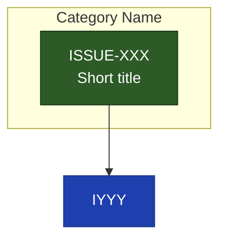

# Sync Issue Dependency Diagram

## Context

Issue files use YAML frontmatter:
- `id`: Issue identifier (e.g., ISSUE-002)
- `title`: Issue title
- `status`: `draft`, `ready`, `in-progress`, `blocked`, `done`
- `depends_on`: Array of issue IDs this depends on
- `blocks`: Array of issue IDs this blocks

## Current Issues

**Active issue files:**
!`find specs/issues/active -name "ISSUE-*.md" -type f 2>/dev/null`

**Done issue files:**
!`find specs/issues/done -name "ISSUE-*.md" -type f 2>/dev/null`

## Task

1. Read each `ISSUE-*.md` file from both `specs/issues/active/` and `specs/issues/done/`
2. Parse YAML frontmatter to extract: `id`, `title`, `status`, `depends_on`, `blocks`
3. Group ALL issues semantically by title into categories:
   - **Foundation**: research, initial exploration
   - **Core**: main implementation
   - **Features**: new capabilities (breadcrumbs, triggers, etc.)
   - **Quality & Validation**: validation, evaluation, self-containment
   - **Format & Docs**: format specs, documentation, cleanup, positioning, examples
   - **Lifecycle**: archive, lifecycle management
4. Generate ONE unified Mermaid diagram with all issues

## Output

Write to `specs/issues/DEPENDENCIES.md`:

```markdown
# Issue Dependencies


```

## Color Legend

- **Green** (`done`): Completed issues
- **Blue** (`ready`): Ready to work on
- **Gray** (`draft`): Not yet ready / backlog

## Rules

- Only include `ISSUE-*.md` files (ignore `spec-*.md`)
- Use short titles (2-3 words max) in nodes
- Solid arrows (`-->`) for direct dependencies
- Dashed arrows (`-.->`) for soft/informing relationships
- Group by semantic meaning, not by status
