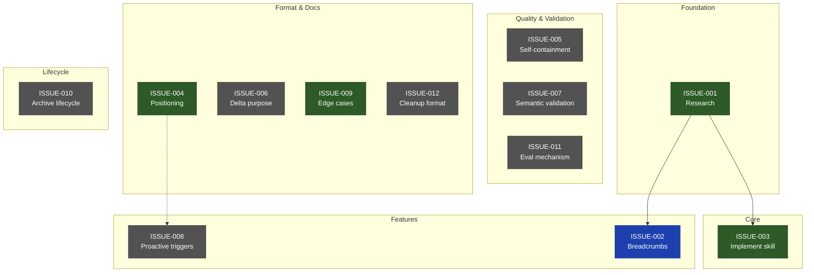

# Issue Dependencies

```mermaid
flowchart TB
    subgraph foundation[Foundation]
        I001[ISSUE-001<br/>Research]
    end

    subgraph core[Core]
        I003[ISSUE-003<br/>Implement skill]
    end

    subgraph features[Features]
        I002[ISSUE-002<br/>Breadcrumbs]
        I008[ISSUE-008<br/>Proactive triggers]
    end

    subgraph quality[Quality & Validation]
        I005[ISSUE-005<br/>Self-containment]
        I007[ISSUE-007<br/>Semantic validation]
        I011[ISSUE-011<br/>Eval mechanism]
    end

    subgraph format[Format & Docs]
        I004[ISSUE-004<br/>Positioning]
        I006[ISSUE-006<br/>Delta purpose]
        I009[ISSUE-009<br/>Edge cases]
        I012[ISSUE-012<br/>Cleanup format]
    end

    subgraph lifecycle[Lifecycle]
        I010[ISSUE-010<br/>Archive lifecycle]
    end

    I001 --> I002
    I001 --> I003
    I004 -.-> I008

    classDef done fill:#2d5a27,stroke:#1a3518,color:#fff
    classDef ready fill:#1e40af,stroke:#1e3a8a,color:#fff
    classDef draft fill:#525252,stroke:#404040,color:#fff

    class I001,I003,I004,I009 done
    class I002 ready
    class I005,I006,I007,I008,I010,I011,I012 draft
```
